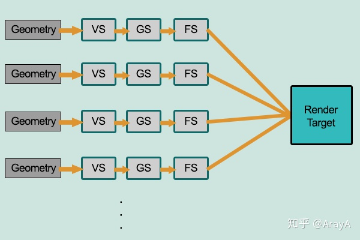
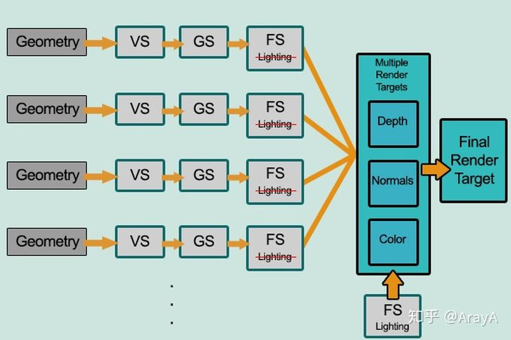

[参考资料1](https://blog.csdn.net/qq_34552886/article/details/85114262)
[参考资料2](https://zhuanlan.zhihu.com/p/111314574)


渲染的方式分为两种:前向渲染,延迟渲染

前向渲染：大多数情况下使用的标准，是线性的渲染管道



延迟渲染: 所有图形都通过管道后再生成最终的图像



延迟渲染避免了看不到的面在fs过程中进行重复的光照计算

eg
```
假设有1个光源和1000个具有光照反射的三角形在view coordinate沿着z轴正方形延伸摆放，法线与z轴平行，即所有三角形xy全相同，只有z不同，但是这里增加一个条件：摆放顺序是无序的。

从屏幕上其实你只能看到一个带光照的三角形，其他的都被挡住了。

那么前向渲染会这样做：

遍历1000个三角形片元
进行深度检测，没通过的忽略
通过检测的进行光照计算
更新帧缓冲区
返回1继续直到遍历结束
由于上面的要求是无序摆放，那么如果运气差一点 1000次深度检测全部都能通过，那么光照会计算1000次，可是因为只能看见最上面的，那么999次光照计算都是多余的。如果光源越多第三步的重复次数越多，整体复杂度也会越高。

延迟渲染引入了GBuffer，它会这样做：

遍历1000个三角形片元
进行深度检测，没通过的忽略
通过的将坐标、光照等信息写入GBuffer
返回1继续直到遍历结束
遍历Gbuffer
利用Gbuffer中的数据进行光照计算
更新帧缓冲区
返回5继续直到遍历结束
```